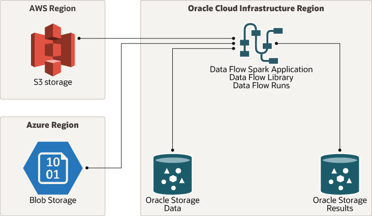

# oci-arch-data-flow

Your data resides in different clouds, such as Amazon Web Services S3 or Azure Blob Storage, but you want to analyze it from a common analysis platform. Oracle Cloud Infrastructure Data Flow is a fully managed Spark service that lets you develop and run big data analytics, regardless of where your data resides, without having to deploy or manage a big data cluster. 

These terraform scripts cover the administrative steps you have to do before using OCI DataFlow. 

## Terraform Provider for Oracle Cloud Infrastructure
The OCI Terraform Provider is now available for automatic download through the Terraform Provider Registry. 
For more information on how to get started view the [documentation](https://www.terraform.io/docs/providers/oci/index.html) 
and [setup guide](https://www.terraform.io/docs/providers/oci/guides/version-3-upgrade.html).

* [Documentation](https://www.terraform.io/docs/providers/oci/index.html)
* [OCI forums](https://cloudcustomerconnect.oracle.com/resources/9c8fa8f96f/summary)
* [Github issues](https://github.com/terraform-providers/terraform-provider-oci/issues)
* [Troubleshooting](https://www.terraform.io/docs/providers/oci/guides/guides/troubleshooting.html)

## Clone the Module
Now, you'll want a local copy of this repo. You can make that with the commands:

    git clone https://github.com/oracle-quickstart/oci-arch-data-flow.git
    cd oci-arch-data-flow
    ls

## Prerequisites
First off, you'll need to do some pre-deploy setup.  That's all detailed [here](https://github.com/cloud-partners/oci-prerequisites).

Secondly, create a `terraform.tfvars` file and populate with the following information:

```
# Authentication
tenancy_ocid         = "<tenancy_ocid>"
user_ocid            = "<user_ocid>"
fingerprint          = "<finger_print>"
private_key_path     = "<pem_private_key_path>"

# SSH Keys
ssh_public_key  = "<public_ssh_key_path>"

# Region
region = "<oci_region>"

# Compartment
compartment_ocid = "<compartment_ocid>"

````

For your convenience, there is a template file included.

Deploy:

    terraform init
    terraform plan
    terraform apply

## Destroy the Deployment
When you no longer need the deployment, you can run this command to destroy it:

    terraform destroy

## Architecture




## Reference Archirecture

- [Analyze data from external object storage sources using Oracle Cloud Infrastructure Data Flow](https://docs.oracle.com/en/solutions/oci-big-data-flow/)
